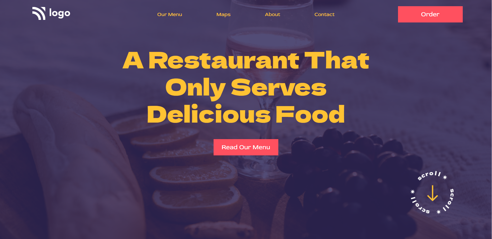

# Assignment 1

## Project 2 [Live Link](https://62e2b86763dac34141a6bfbb--admirable-dragon-4d73f0.netlify.app/)

-   Skills Gained in this project
    -   Setting up the background image.
    -   Different properties to fit the background image.

---

## Time taken to finish this project

-   Approximately 7-8 hour taken to complete this one.

#### Screenshot

